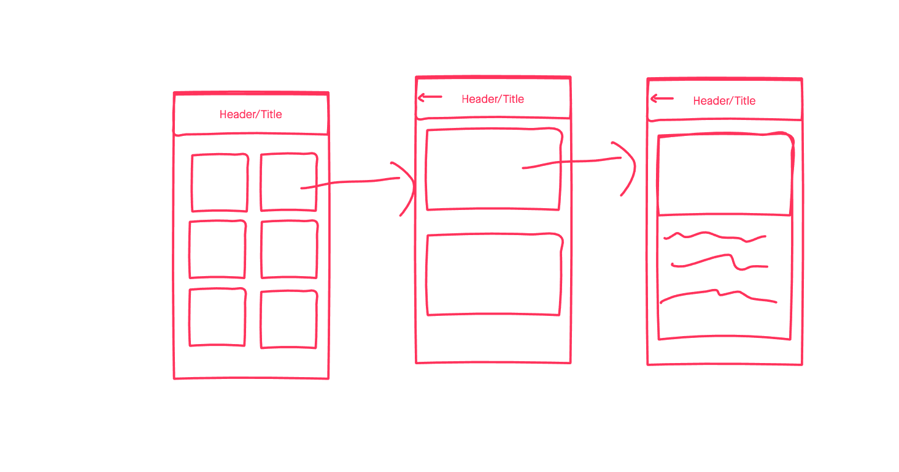
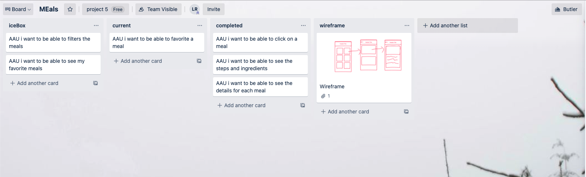

# MEals

a simple mobile application where you can see meals their instructions & steps on how to make them.

## Technologies Used
- React.js
- React Native
- HTML 5
- JavaScript
- Trello Board
- Wireframe
- Invisionapp
- Expo

## Screenshots

## Getting started

[Click here](https://expo.io/@luisxros/projects/meals-app) to see the deployed app on Expo!

## Explanation

I used React-Native to build  mobile application that would show meals and their details like ingredients and steps on how to make them. I used components to style and arrange my application. I used models to set up the way my data was going to be used.

## Approach

I used a trelloBoard to write my user stories and see what kind of approach i would take. I also used a wireframe to design my app and each screen as you progress through the app.

## Future Enhancements

- Add a favorites page
- add a filter
- add tabs to see either all meals or just your favorites
- make users add their own meals
